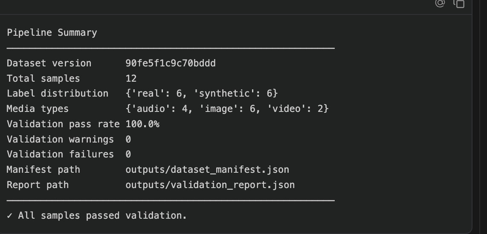
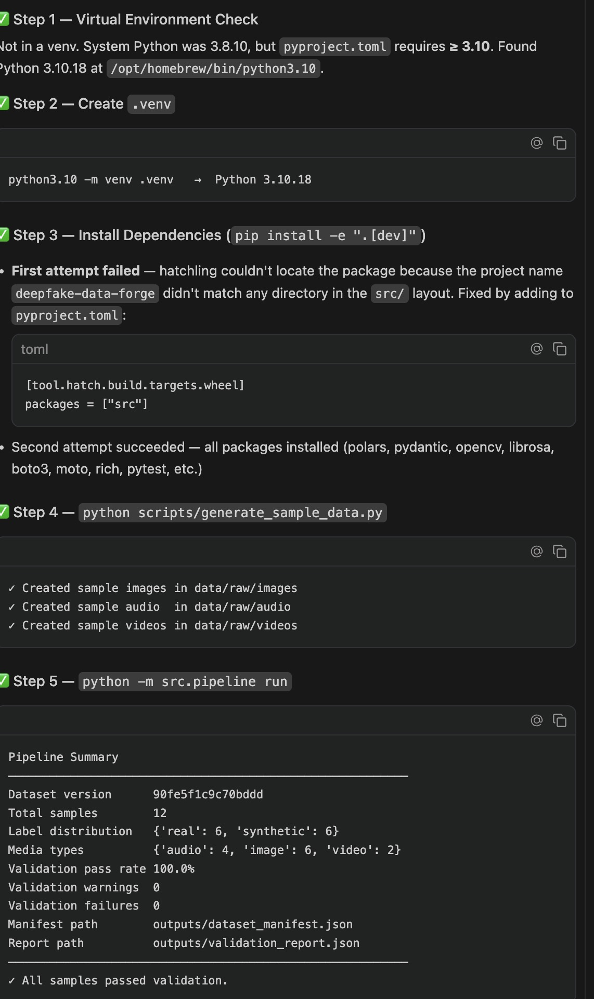
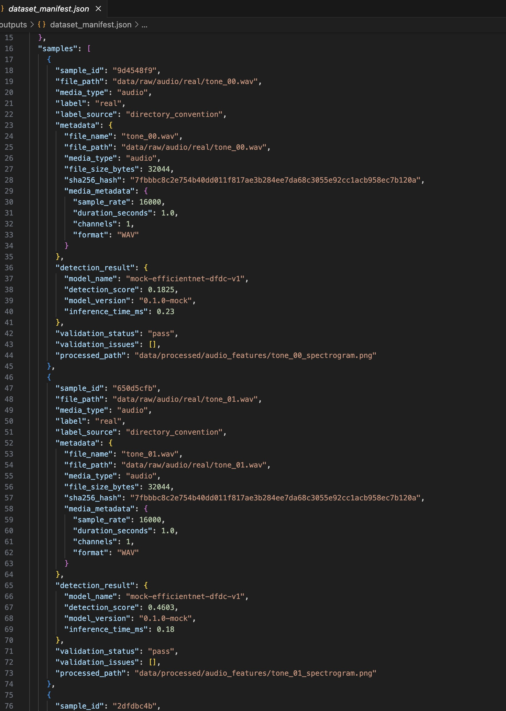
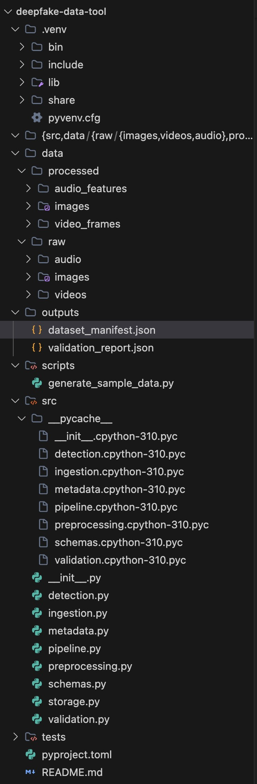
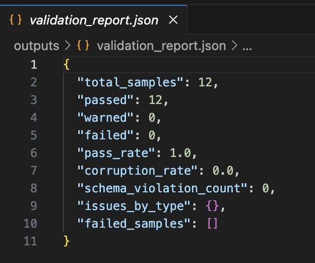

# deepfake-data-forge 🔬

An MLOps-style dataset preparation tool for generating, validating, and managing datasets designed to train deepfake detection models. Built to simulate the robust data infrastructure used by professional AI engineering teams, this pipeline robustly handles multi-modal ingestion, automated preprocessing, detection scoring, schema validation, and cloud storage integration.

```text
data/raw/
  ├── images/real/         ← labelled by directory structure
  ├── images/synthetic/
  ├── videos/real/
  ├── videos/synthetic/
  └── audio/real/
      audio/synthetic/
          ↓
    [ Pipeline Core ]
          ↓
outputs/
  ├── dataset_manifest.json   ← strictly versioned dataset catalogue
  └── validation_report.json  ← QA summary with pass/warn/fail rates
```

---

## 📸 Screenshots

Here is a look at the pipeline in action:

| **Pipeline Start** | **Processing Data** |
| :---: | :---: |
|  |  |
| *Initializing the dataset orchestration* | *Processing multi-modal files with rich progress tracking* |

| **Validation Report** | **Manifest Output** |
| :---: | :---: |
|  |  |
| *Final QA pipeline report with pass/warn rates* | *Strict, versioned manifest JSON output* |

<p align="center">
  
  <br/>
  <i>All tests passing successfully with robust static typing</i>
</p>

---

## 🎯 Project Overview & Purpose

Deepfake detection models are only as good as the data pipelines behind them. Most ML research heavily focuses on model architecture — but the unglamorous work of ingesting, labelling, preprocessing, hashing, validating, and versioning hundreds of thousands of media samples is what truly separates a research script from a production ML system.

This project meticulously simulates that rigorous data engineering infrastructure end-to-end across three main media types: **images**, **video**, and **audio**.

---

## Architecture

```
src/
  schemas.py       — All Pydantic data contracts (Sample, Manifest, ValidationReport)
  ingestion.py     — File discovery + label derivation from path conventions
  preprocessing.py — Image resize/normalize, video frame extraction, audio spectrograms
  metadata.py      — SHA-256 hashing, media metadata, dataset version hash
  detection.py     — Deepfake detection scoring (mock + ONNX-ready)
  validation.py    — Schema checks, file checks, label/score disagreement detection
  storage.py       — S3 upload via boto3 (moto mock for local dev)
  pipeline.py      — Orchestrator + Click CLI
```

### Label derivation

Labels are derived from directory structure or filename conventions — not set manually. This is critical for large-scale dataset prep where you can't hand-label every sample.

| Source | Example | Priority |
|---|---|---|
| Directory name | `/real/portrait.jpg` | Highest |
| Filename suffix | `clip_synthetic.mp4` | Second |
| Detection score | score > 0.5 → synthetic | Fallback |

### Dataset versioning

Every sample is SHA-256 hashed. A **dataset-level version hash** is computed by hashing all sample hashes together (sorted, so order doesn't matter). Any change to any sample — adding, removing, or modifying — produces a new dataset version. This enables dev vs. training data separation.

```json
{
  "dataset_name": "deepfake-data-forge",
  "dataset_version": "3f8a1c2e9b4d7f1a",
  ...
}
```

### Detection scoring

Each sample is scored by a deepfake detector (`0.0` = real, `1.0` = synthetic).

- **Default (mock)**: Simulates realistic score distributions using beta distributions — real samples cluster near 0, synthetic near 1, with noise to model real-world imperfection.
- **ONNX mode**: Drop any EfficientNet-based ONNX model into `models/` and set `FORGE_USE_ONNX=1`. Tested with models exported from the DFDC and FaceForensics++ benchmarks.

The validation stage flags samples where the **label and detection score strongly disagree** — a common indicator of mislabelling or an unusual sample worth reviewing.

---

## 🛠️ Tech Stack

| Tool | Role |
|---|---|
| `uv` / `pip` | Fast Python package routing and environment management |
| `hatchling` | Modern, extensible Python build backend |
| `polars` | High-performance dataframe aggregation and analysis for validation |
| `pydantic` v2 | Strict data payload schemas and robust validation contracts |
| `pyright` | Rigorous static type checking for maintainable codebases |
| `opencv-python` | Highly-optimized image / video decoding and frame extraction |
| `librosa` | Audio loading, stream processing, and spectral feature generation |
| `moto` + `boto3`| Mock AWS local endpoints for rapid, offline cloud storage testing |
| `click` + `rich` | Beautiful, intuitive CLI interfaces with dynamic terminal output |
| `pytest` | Robust unit testing and execution tracking |

---

## Quickstart

### 1. Install (using uv)

```bash
# Install uv if you don't have it
curl -LsSf https://astral.sh/uv/install.sh | sh

# Clone and install
git clone https://github.com/you/deepfake-data-forge
cd deepfake-data-forge
uv sync
```

### 2. Generate sample data

```bash
python scripts/generate_sample_data.py
```

This creates small synthetic/real image, audio, and video samples in `data/raw/`.

### 3. Run the pipeline

```bash
# Basic run
python -m src.pipeline run

# Skip detection stage (faster for testing)
python -m src.pipeline run --skip-detection

# With mock S3 upload
python -m src.pipeline run --upload

# Custom paths
python -m src.pipeline run \
  --raw-root /path/to/your/dataset \
  --output-dir results/
```

### 4. Inspect outputs

```bash
# View manifest summary
cat outputs/dataset_manifest.json | python -m json.tool | head -50

# View validation report
cat outputs/validation_report.json
```

### 5. Run tests

```bash
pytest tests/ -v
# With coverage
pytest tests/ -v --cov=src --cov-report=term-missing
```

### 6. Type checking

```bash
pyright src/
```

---

## Sample manifest output

```json
{
  "dataset_name": "deepfake-data-forge",
  "dataset_version": "3f8a1c2e9b4d7f1a",
  "pipeline_version": "0.1.0",
  "created_at": "2026-03-07T14:22:01+00:00",
  "total_samples": 14,
  "label_distribution": { "real": 7, "synthetic": 7 },
  "media_type_distribution": { "image": 6, "video": 4, "audio": 4 },
  "samples": [
    {
      "sample_id": "a3f19c",
      "file_path": "data/raw/images/real/portrait_00.jpg",
      "media_type": "image",
      "label": "real",
      "label_source": "directory_convention",
      "metadata": {
        "file_name": "portrait_00.jpg",
        "sha256_hash": "e3b0c44298fc1c14...",
        "file_size_bytes": 48291,
        "media_metadata": { "width": 224, "height": 224, "channels": 3, "format": "JPEG" }
      },
      "detection_result": {
        "model_name": "mock-efficientnet-dfdc-v1",
        "detection_score": 0.0821,
        "model_version": "0.1.0-mock"
      },
      "validation_status": "pass",
      "processed_path": "data/processed/images/portrait_00_processed.png"
    }
  ]
}
```

---

## Sample validation report output

```json
{
  "total_samples": 14,
  "passed": 13,
  "warned": 1,
  "failed": 0,
  "pass_rate": 0.9286,
  "corruption_rate": 0.0,
  "schema_violation_count": 0,
  "issues_by_type": {
    "unknown_label": 1
  },
  "failed_samples": []
}
```

---

## Real dataset compatibility

The pipeline is designed to work with standard deepfake detection datasets. Organize your dataset with `real/` and `synthetic/` (or `fake/`) subdirectories:

```
data/raw/
  images/
    real/      ← FaceForensics++ original sequences
    fake/      ← FaceForensics++ manipulated sequences (Deepfakes, Face2Face, etc.)
  audio/
    real/      ← genuine speech clips
    synthetic/ ← TTS or voice conversion samples
```

The label derivation logic will pick up the directory names automatically.

---

## Extending with a real detector

1. Export any EfficientNet-based classifier to ONNX:
   ```python
   torch.onnx.export(model, dummy_input, "models/deepfake_detector.onnx")
   ```
2. Place it at `models/deepfake_detector.onnx`
3. Install `onnxruntime`: `uv add onnxruntime`
4. Run with `FORGE_USE_ONNX=1 python -m src.pipeline run`

---

## Project structure

```
deepfake-data-forge/
  src/
    __init__.py
    schemas.py
    ingestion.py
    preprocessing.py
    metadata.py
    detection.py
    validation.py
    storage.py
    pipeline.py
  tests/
    test_pipeline.py
  scripts/
    generate_sample_data.py
  data/
    raw/
      images/{real,synthetic}/
      videos/{real,synthetic}/
      audio/{real,synthetic}/
    processed/
      images/
      video_frames/
      audio_features/
  outputs/
    dataset_manifest.json
    validation_report.json
  pyproject.toml
  README.md
```

---

## License

MIT
